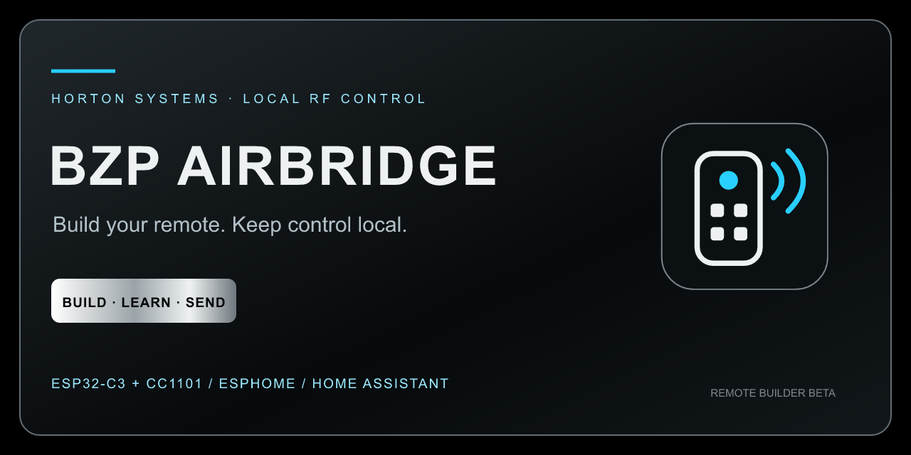
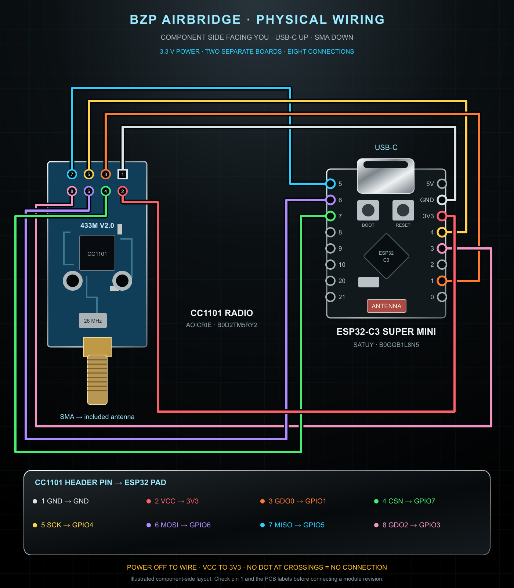

# BZP Airbridge



**Build your remote. Learn its buttons. Keep control local.**

An ESP32-C3 + CC1101 RF bridge with an offline settings page, visual Remote Builder, encrypted ESPHome connectivity, and optional Home Assistant/HomeKit fan control.

**v0.2.0 beta.** Airbar power replay has been confirmed on the project hardware. A captured signal is not proof of appliance compatibility. This is not a universal remote or rolling-code bypass.

## Features

- Four custom remotes sharing eight custom button slots.
- Name, icon, and position editing before learning individual buttons.
- Animated 20-second listening countdown and explicit save/discard.
- Private JSON backup/import with schema and pulse validation.
- Stable Home Assistant custom-button entities.
- Existing Vornado power/speed controls and stored captures preserved.
- 2.4 GHz Wi-Fi configuration with rollback, remote reboot, and password-protected ESPHome OTA.
- Horton Systems chrome/cyan styling; all page assets stored on-device.

**Update delivery:** Auto updates and Check for updates remain staged controls. They do not download GitHub releases in this beta. ESPHome OTA works separately.

## Start here

1. [Wire the hardware](docs/WIRING.md) with USB disconnected.
2. [Build and flash](docs/SETUP.md) using your own private credentials.
3. Open http://bzp-airbridge.local or your device’s local IP.
4. [Build and learn remotes](docs/REMOTE-BUILDER.md).
5. [Add Home Assistant and Apple Home](docs/HOME-ASSISTANT.md).



## Compatibility

Project hardware: ESP32-C3 Super Mini (ASIN B0GGB1L8N5) and AOICRIE CC1101/SMA 433 MHz radio (ASIN B0D2TM5RY2). Board revisions differ: follow signal names and check pin 1.

Shipped profile: **433.937 MHz ASK/OOK**, eight-repeat playback. All custom remotes share this profile. Custom capacity: 16–256 alternating pulses, 50–30,000 µs each, 3–500 ms total. Protected legacy slots retain their 512-pulse format. No infrared, Bluetooth, rolling-code, automatic decoding, arbitrary FSK, or multi-frequency support is claimed. Operate only authorized devices and obey local RF rules.

## Home Assistant

The original three buttons retain their names. Eight additional entities are named **Custom button 1–8**. Their identities stay stable when you rename/reorder layout buttons; rename them separately in Home Assistant if desired. Empty slots refuse transmission.

The optional [fan package](examples/home-assistant/bzp_airbridge.yaml) wraps the Airbar controls as a three-speed fan. Its state is estimated, not physical feedback. Custom remotes do not automatically become fans/lights/covers.

## Development

```sh
python3 -m venv .venv
. .venv/bin/activate
pip install -r requirements.txt
cp firmware/secrets.example.yaml firmware/secrets.yaml
# Replace example credentials before flashing.
python tools/build_ui.py
c++ -std=c++17 tests/test_pulses.cpp -o /tmp/airbridge-pulses && /tmp/airbridge-pulses
c++ -std=c++17 tests/test_builder.cpp -o /tmp/airbridge-builder && /tmp/airbridge-builder
node tests/test_builder.js
esphome compile firmware/airbridge.yaml
```

[Architecture](docs/ARCHITECTURE.md) · [Validation](docs/VALIDATION.md) · [Brand kit](docs/BRAND.md) · [Changelog](CHANGELOG.md) · [Contributing](CONTRIBUTING.md) · [Security](SECURITY.md)

[Settings preview](docs/settings-preview.html) works when served locally and cannot control hardware. [Snap-fit enclosure files](hardware/enclosure/PRINT_AND_ASSEMBLY.md) are prototypes, not certified fits for every board revision.

[Full settings screenshot](assets/remote-builder-preview.png) · [390 px layout preview](docs/mobile-preview.html)

## Privacy and license

Never publish personal secrets, compiled firmware, raw radio logs, or private remote backups. RF backups can control your devices even without Wi-Fi credentials. Public releases contain source only.

Original code/artwork: [MIT](LICENSE). Horton Systems branding remains its owner's property. See [third-party notices](THIRD_PARTY_NOTICES.md). Independent project, unaffiliated with Vornado, Espressif, Texas Instruments, Apple, or Home Assistant.
